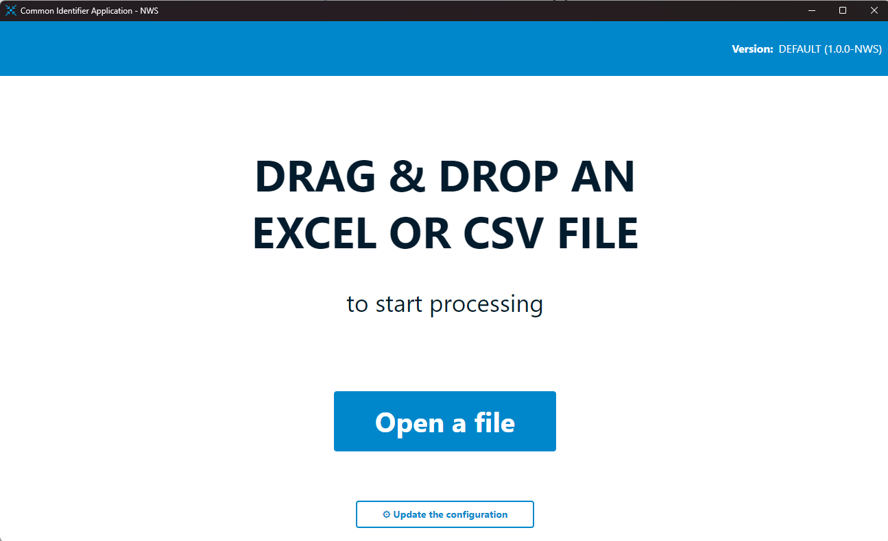
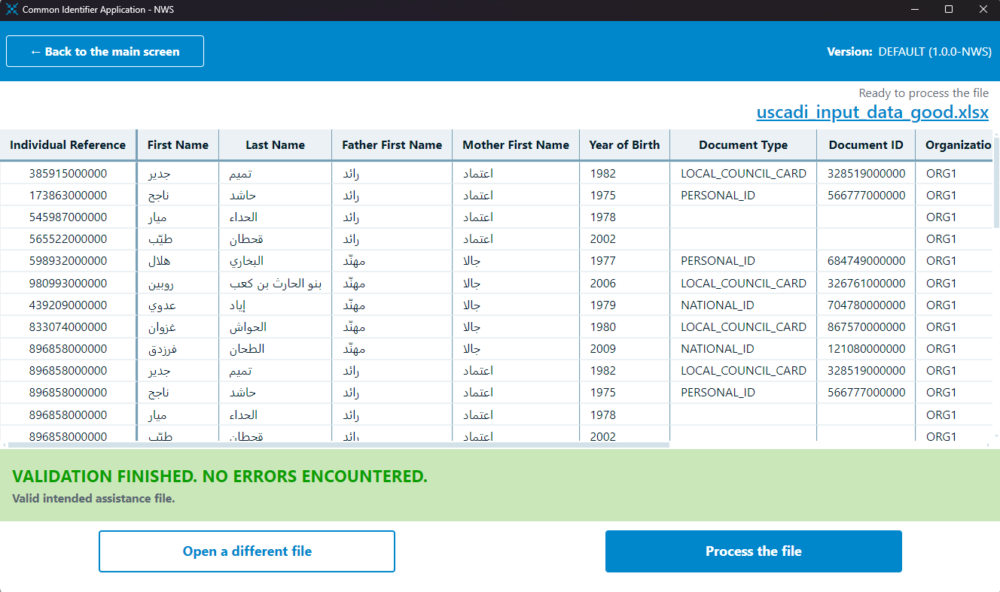
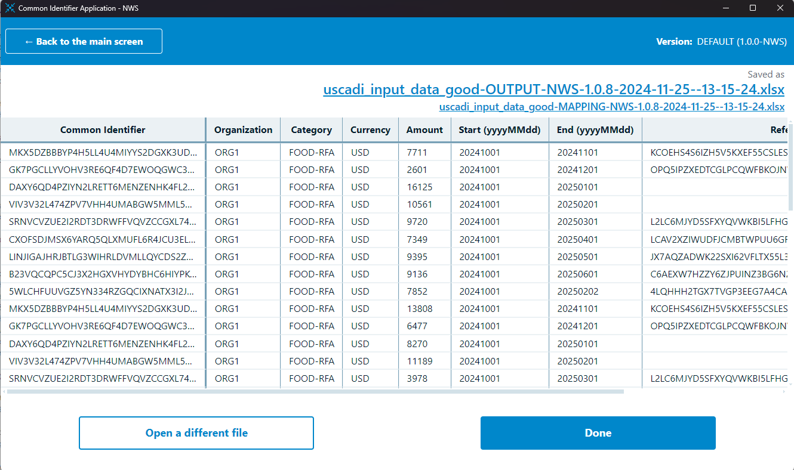

# Common Identifier Application

## ❓ Overview

This Common Identifier Application is a tool that generates pseudonymous hashed identifiers for individuals based on provided tabular information. The algorithms that generate these identifiers are "pluggable" into the main application, so can be fully customised and user-defined. Currently there are two use-cases facilitated by this application - simple hashing of ID numbers, and the generation of unique IDs from biographic data - but writing custom algorithms for other situations is trivial.

This is a fully typescript backend application with an optional ElectronJS frontend; This repository contains the frontend code and electron API, with all other logic included as submodules from their relevant repos. **Only** use this repository if you want the full UI; if only the backend is required (for programmatic use), refer to the [`Common Identifier Shared`](https://github.com/wfp/common-identifier-algorithm-shared) repository.

<table style="margin-left:auto;margin-right:auto;">
  <tbody>
    <tr>
      <td style="text-align:center;border-style:hidden;">
        
      </td>
      <td style="text-align: center;">
        
      </td>
    </tr>
    <tr>
      <td style="text-align:center;border-style:hidden;">
        
      </td>
      <td style="text-align: center;">
        
      </td>
    </tr>
  </tbody>
</table>

### Key Features

- Generation of pseudonymous identifiers from tabular data
- Supports CSV, XLSX, or programmatic use
- Supports pluggable algorithms to meet wide use-cases
- Entirely configurable via external configuration files
- Customisable, performant, and robust data validation
- Shiny Microsoft Windows frontend

### Feature Roadmap

- [ ] More algorithms
- [x] Performance improvements
- [ ] Support for non-SHA256 hashing implementations
- [ ] Overhaul of validation logic for stricter type checking
- [ ] Better Windows Code Signing (FE only)
- [ ] OSX & Linux support (FE only)
- [ ] Further pluggable elements into processing pipeline
  - [ ] Download from / point to source files in remote locations
  - [ ] Encryption of output files using PGP
  - [ ] Direct upload of files to target system

### Getting Started

```bash
git clone https://github.com/wfp/common-identifier-application.git

# clone the relevant algorithm subdirectory into src/main
# unfortunately this is a little complex with the current git tooling
git clone --filter=blob:none --no-checkout --depth 1 https://github.com/wfp/common-identifier-algorithms algo_repo
cd algo_repo
git sparse-checkout init --no-cone
git sparse-checkout set algorithms/<algo_name> # this is the name of the subdirectory containing the algorithm code
git checkout
cp -r algorithms/<algo_name> ../electron/main/algo
cd ../ && rm -r algo_repo # or "rm algo_repo -r -fo" on Windows

# main application
cd ../../
npm install
# npm install -g tsx (if not already installed)
tsx scripts/activate-algo.ts <algo_name>
npm run build
npm run start
```

Unit tests for the algorithm (shared and algorithm-specific) are written using the JEST test framework. Run the test suite:

```bash
# the `--experimental-vm-modules` node option is required to load the ES module code
# for the frontend tests
export NODE_OPTIONS="$NODE_OPTIONS --experimental-vm-modules"

# Now both backend and frontend tests can be run, add the --coverage flag for coverage
npx jest
```

The application uses the `debug` package for logging. To log every CommonID-related message to set the environment variable `DEBUG` to `CID:*` - to see only specific log lines refine the `CID:*` pattern. For example to run the application for development with every CommonID component logging to the console:

```
DEBUG=CID:* npm run dev
```

All logging lines are prefixed with `CID:` (for CommonID), and should look like the following:

```
  CID:loadConfig CONFIG HASH: 3b4b6ab8a68202ebcf3221d5c1a728b7 +33ms
  CID:loadSaltFile Attempting to load salt file from ... +0ms
  CID:loadSaltFile SALT FILE looks OK +1ms
  CID:ConfigStore Backup config validation success - using it as config +34ms
```

## 🚀 Usage

There are three ways to use this application:

1. [INTENDED USAGE] Desktop UI
   - Users can install the ElectronJS application on Windows and submit their intended assistance files for processing.
   - The application will validate the input data against validation rules defined within a separate configuration file.
   - Once validated, relevant fields in the dataset are processed according to the specific algorithm implementation.
2. Programmatically, with file-based data
   - It is possible to use purely the backend of this application (without the UI), while maintaining all of the built-in features, by calling the `preprocessFile` and `processFile` functions with file-based data respectively.
   - Currently only CSV and XLSX data formats are supported; an example of this approach is provided in the [Standalone Repo](https://github.com/wfp/common-identifier-algorithm-shared).
3. Programmatically, with array-based data
   - Implement solely the algorithm class and provide it with data directly.
   - If using this approach, it is recommended to also implement the data validation checks and error handling.

## 📂 Application Structure

```
📦common-identifier-application
 ┣ 📂common                   # shared components and types for BE and FE
 ┣ 📂electron                 # 
 ┃ ┣ 📂main                   # 
 ┃ ┃ ┣ 📂algo                 # the selected algorithm for this application
 ┃ ┃ ┣ 📂ipc-handlers         # the interface functions between frontend and backend         
 ┃ ┃ ┣ 📜active_algorithm.ts  # a declaration of which algo to use - see scripts/activate-algo.js                 
 ┃ ┃ ┣ 📜index.ts             # setup of the app window and registration of API handlers     
 ┃ ┃ ┗ 📜util.ts              # general utils for initial app launch     
 ┃ ┗ 📜preload.mts            # expose API components to the render process       
 ┣ 📂public                   # public assets for icons and rendering
 ┣ 📂scripts                  # build and package scripts
 ┣ 📂src                      # 
 ┃ ┣ 📂components             # reusuable react components
 ┃ ┣ 📂screens                # react components per UI screen
 ┃ ┣ 📜App.tsx                # main UI entrypoint including store and screen selection
 ┃ ┣ 📜index.css              # UI styling
 ┃ ┣ 📜index.tsx              # react registration with DOM
 ┃ ┣ 📜intercomApi.ts         # callback registration with backend
 ┃ ┣ 📜store.ts               # declaration of store constants
 ┃ ┣ 📜types.ts               # callbacks for data stores
 ┃ ┗ 📜util.ts                # data processing related utils
 ┗ [...]
```

### Backend

The [`common-identifier-application-shared`](https://github.com/wfp/common-identifier-algorithm-shared) repository is the backbone of the Common Identifier application and contains all functional components for reading / writing / validating / processing data and configuration management. This functionality is entirely decoupled from any specific algorithm implementation, instead providing all of the supporting functionality to actual run the application with any compliant pluggable algorithm.

This codebase is installed directly from GitHub via NPM, see `package.json`.

### Algorithm

For the application backend to work, it MUST be implemented with at least one pluggable algorithm from the [`common-identifier-algorithms`](https://github.com/wfp/common-identifier-algorithms) repository. The algorithm must be cloned to the `electron/main/algo` directory and activated using the `scripts/activate-algo.ts --algorithm-id <algorithm-id>` script.

Any algorithm implementation has the following structure:

```
📦algo-*
 ┣ 📂config         # contains the default configuration file and any UI styling overrides
 ┣ 📂tests          # tests for the algorithm where necessary
 ┗ 📜index.ts       # main algorithm entrypoint, exporting a makeHasher function and ALGORITHM_ID const
```

For an algorithm to be "pluggable" into the main application, it must expose both a `ALGORITHM_ID` constant and a `makerHasher` function from within `index.ts`. The constant is used during configuration file validation and for application naming, and the function should create a Hasher class extending `BaseHasher` and exposing a single `generateHashForObject` method. This method is called with a single row of input data, it should perform whatever operations are needed to generate the desired output, and return those output values. This is the simplest possible hasher:

```ts
import {
  joinFieldsForHash,
  cleanValueList,
  extractAlgoColumnsFromObject,
  BaseHasher
} from 'common-identifier-algorithm-shared';
import type { Config, Validation, makeHasherFunction } from 'common-identifier-algorithm-shared';

class MyAlgorithmHasher extends BaseHasher {
    constructor(config: Config.CoreConfiguration["algorithm"]) {
        super(config);
    }

    generateHashForObject = (obj: Validation.Data["row"]) {
        // generate what ever you need here and return
        return {}
    }
}
export const makeHasher: makeHasherFunction = (config: Config.CoreConfiguration["algorithm"]) => {
    // some validation checks here
    return new MyAlgorithmHasher(config);
}
```

Within the main application, the return value from `generateHashForObject` is included in the output file provided a corresponding header key is included in the configuration file. Pluggable algorithms are also dependent on a configuration file that provides instructions on data schema, validation rules, algorithm parameters, and file naming conventions - see the README of the shared repository for more details.

### API

The API layer is the `electron` part of this application, explicitly exposing certain backend functional components to the frontend.

The type definition and implementation detail can be found in [`common/api.ts`](./common/api.ts).

### Frontend

The frontend of this application has the following tech stack:
 - ReactJS: rendering
 - Zustand: Local storage and state management
 - 


The UI accepts three types of document as input:
 - Configuration files - `.toml` files containing specification on how other input files should be processed.
 - Assistance files - `.xlsx` or `.csv` files containing identifiers and corresponding assistance information.
 - Mapping files - `.xlsx` or `.csv` files containing identifiers only.

---