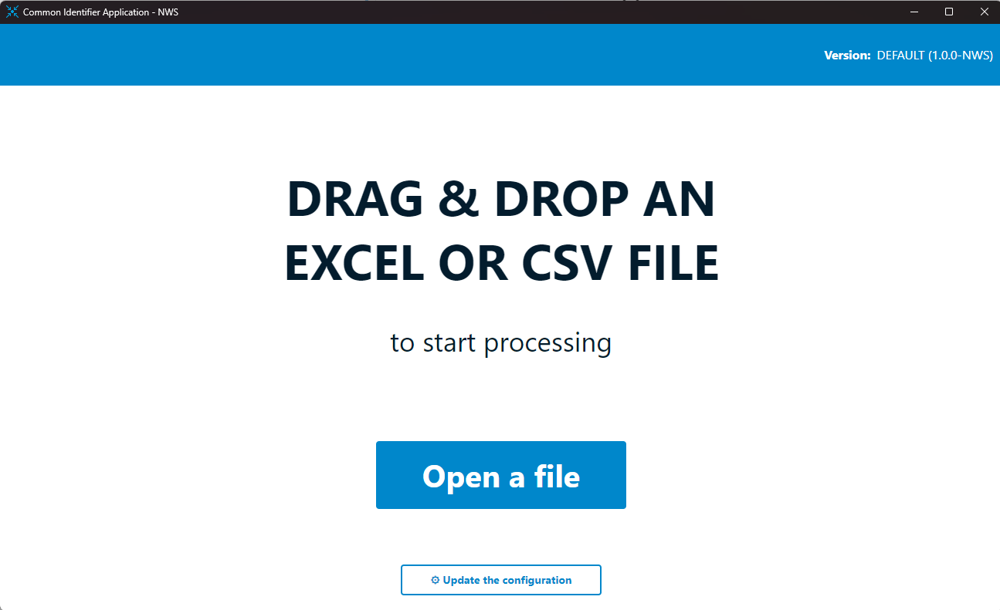
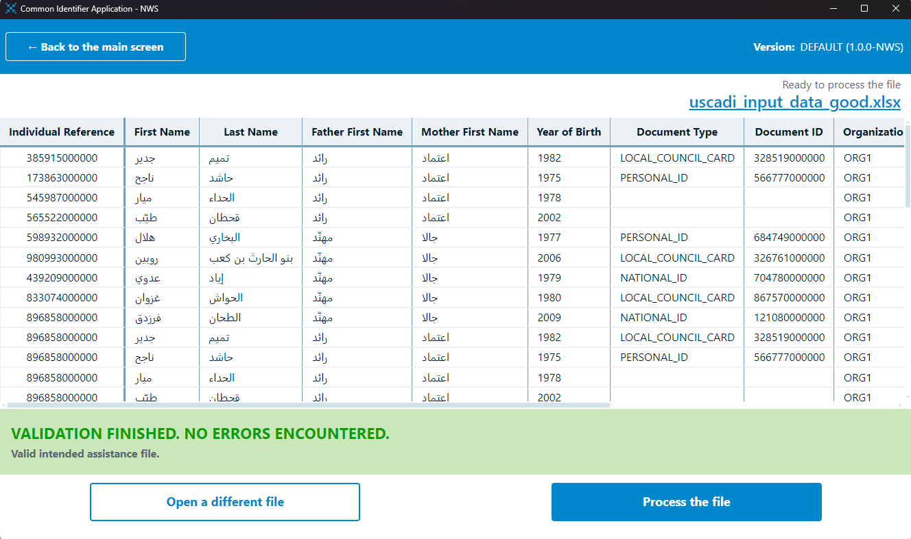
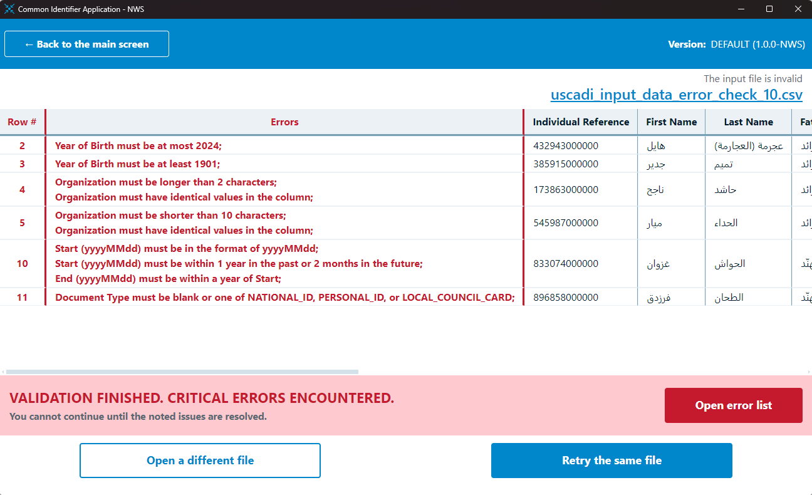
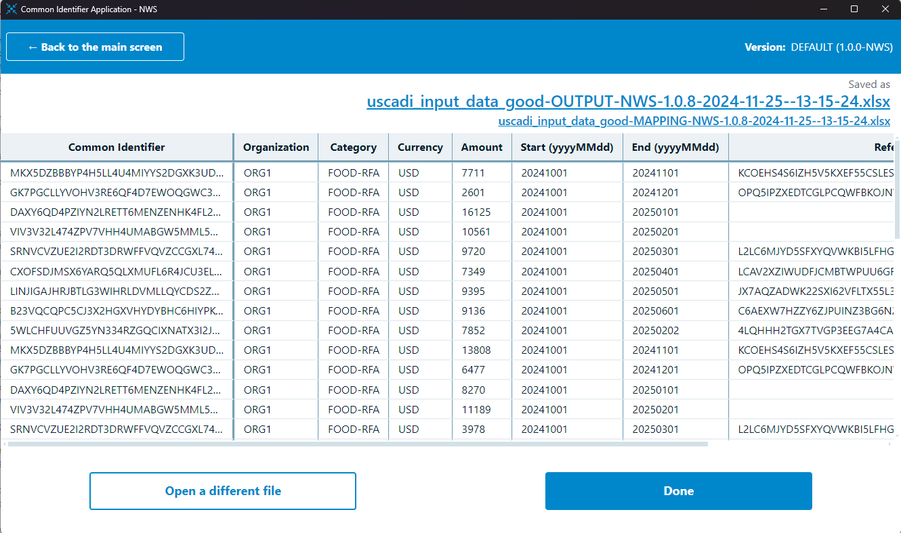
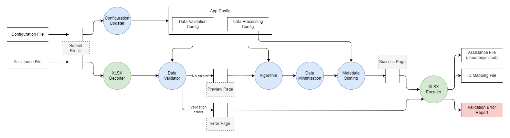

# Common Identifier Application

## ❓ Overview

This Common Identifier Application is a tool that generates pseudonymous hashed identifiers for individuals based on provided tabular information. The algorithms that generate these identifiers are "pluggable" into the main application, so can be fully customised and user-defined. Currently there are two use-cases facilitated by this application - simple hashing of ID numbers, and the generation of unique IDs from biographic data - but writing custom algorithms for other situations is trivial.

This is a fully typescript backend application with an optional ElectronJS frontend; This repository contains the frontend code and electron API, with all other logic included as submodules from their relevant repos.

<table style="margin-left:auto;margin-right:auto;">
  <tbody>
    <tr>
      <td style="text-align:center;border-style:hidden;">
        
      </td>
      <td style="text-align: center;">
        
      </td>
    </tr>
    <tr>
      <td style="text-align:center;border-style:hidden;">
        
      </td>
      <td style="text-align: center;">
        
      </td>
    </tr>
  </tbody>
</table>

### Key Features

- Generation of pseudonymous identifiers from tabular data
- Supports CSV, XLSX, or programmatic use
- Supports pluggable algorithms to meet wide use-cases
- Entirely configurable via external configuration files
- Customisable, performant, and robust data validation
- Shiny Microsoft Windows frontend

### Feature Roadmap

- [ ] More algorithms
- [x] Performance improvements
- [ ] Support for non-SHA256 hashing implementations
- [ ] Overhaul of validation logic for stricter type checking
- [ ] Better Windows Code Signing (FE only)
- [ ] OSX & Linux support (FE only)
- [ ] Further pluggable elements into processing pipeline
  - [ ] Download from / point to source files in remote locations
  - [ ] Encryption of output files using PGP
  - [ ] Direct upload of files to target system

### Project Repo Structure

Here is a list of all repositories included as part of this project:

- [SYR-BB-PREPROCESSING-APP](https://dev.azure.com/worldfoodprogramme/_git/SYR-BB-PREPROCESSING-APP) - This is the primary project repo containing the UI implementation and linked algorithms
- [SYR-BB-PREPROCESSING-STANDALONE](https://dev.azure.com/worldfoodprogramme/SYR-BB-PREPROCESSING-APP/_git/SYR-BB-PREPROCESSING-STANDALONE) - This repository contains an example implementation of the common identifier application without the UI.
- [ALGO-SHARED](https://dev.azure.com/worldfoodprogramme/SYR-BB-PREPROCESSING-APP/_git/ALGO-SHARED) - This is the main functional component of the application. This repository contains all code relating to file handling, configuration management, and data processing, but importantly is algorithm-agnostic.
- [ALGO-GOS](https://dev.azure.com/worldfoodprogramme/SYR-BB-PREPROCESSING-APP/_git/ALGO-GOS) - This repo contains the algorithm implementation for the GOS region.
- [ALGO-NWS](https://dev.azure.com/worldfoodprogramme/SYR-BB-PREPROCESSING-APP/_git/ALGO-NWS) - This repo contains the algorithm implementation for the NWS region.
- [ALGO-*] - any future algorithm implementations would follow this naming convention.

### Getting Started

```bash
git clone <this repo>
git submodule init
git submodule update

# include submodule of the relevant git repository
git submodule add <algo_repo_url> ./src/main/<algo_name>

# renderer
cd ./src/renderer
npm install
npm run build # build the rendered components
# OR, npm run dev for live hot-reloading server

# main application
cd ../../
npm install
node tools/activate-algo.js <algo_name> <region_name>
npm run start # to use the pre-built rendered components
# OR, npm run start:web to link with live server
```

Unit tests for the algorithm (shared and algorithm-specific) are written using the JEST test framework. Run the test suite:

```bash
# the `--experimental-vm-modules` node option is required to load the ES module code
# for the frontend tests
export NODE_OPTIONS="$NODE_OPTIONS --experimental-vm-modules"

# Now both backend and frontend tests can be run, add the --coverage flag for coverage
npx jest
```

The application uses the `debug` package to do logging. To log every CommonID-related message to set the environment variable `DEBUG` to `CID:*` - to see only specific log lines refine the `CID:*` pattern. For example to run the application for development with every CommonID component logging to the console:

```
DEBUG=CID:* npm start
```

All logging lines are prefixed with `CID:` (for CommonID), and should look like the following:

```
  CID:loadConfig CONFIG HASH: 3b4b6ab8a68202ebcf3221d5c1a728b7 +33ms
  CID:loadSaltFile Attempting to load salt file from ... +0ms
  CID:loadSaltFile SALT FILE looks OK +1ms
  CID:ConfigStore Backup config validation success - using it as config +34ms
```

## 🚀 Usage

There are three ways to "use" this application:

1. [INTENDED USAGE] Desktop UI
   - Users can install the ElectronJS application on Windows and submit their intended assistance files for processing.
   - The application will validate the input data against validation rules defined within a separate configuration file.
   - Once validated, relevant fields in the dataset are processed according to the specific algorithm implementation.
2. Programmatically, with file-based data
   - It is possible to use purely the backend of this application (without the UI), while maintaining all of the built-in features, by calling the `preprocessFile` and `processFile` functions with file-based data respectively.
   - Currently only CSV and XLSX data formats are supported; an example of this approach is provided in the [Standalone Repo](https://dev.azure.com/worldfoodprogramme/SYR-BB-PREPROCESSING-APP/_git/SYR-BB-PREPROCESSING-STANDALONE).
3. Programmatically, with array-based data
   - Implement solely the algorithm class and provide it with data directly.
   - If using this approach, it is recommended to also implement the data validation checks and error handling.

## 📂 Application Structure

### Backend

The `ALGO-SHARED` repository in this project is the backbone of the Common Identifier application and contains all functional components for reading / writing / validating / processing data and configuration management. This functionality is entirely decoupled from any specific algorithm implementation, instead providing all of the supporting functionality to actual run the application with any compliant pluggable algorithm.

```toml
📦algo-shared
 ┣ 📂config         # functions related to the handling of configuration files
 ┣ 📂decoding       # reading and decoding files - CSV or XLSX
 ┣ 📂encoding       # encoding and writing files - CSV or XLSX
 ┣ 📂hashing        # base hashing logic and supporting utilities
 ┣ 📂processing     # main API into the backend logic
 ┣ 📂tests          # tests for all components
 ┗ 📂validation     # validation logic and wrappers
   ┗ 📂validators   # actual validation classes
```

Independently, this repository can't do anything; it MUST be implemented with at least one algorithm.

### Algorithm

```toml
📦algo-*
 ┣ 📂config         # contains the default configuration file and any UI styling overrides
 ┣ 📂tests          # tests for the algorithm where necessary
 ┗ 📜index.ts       # main algorithm entrypoint, exporting a makeHasher function and REGION const
```

For an algorithm to be "pluggable" into the main application, it must expose both a `REGION` constant and a `makerHasher` function from within `index.ts`. The constant is used during configuration file validation and for application naming, and the function should create a Hasher class extending `BaseHasher` and exposing a single `generateHashForObject` method. This method is called with a single row of input data, it should perform whatever operations are needed to generate the desired output, and return those output values. This is the simplest possible hasher:

```ts
import { BaseHasher, makeHasherFunction } from '../algo-shared/hashing/base.js';
import type { Config } from '../algo-shared/config/Config.js';
import type { Validation } from '../algo-shared/validation/Validation.js';

class MyAlgorithmHasher extends BaseHasher {
    constructor(config: Config.Options["algorithm"]) {
        super(config);
    }

    generateHashForObject = (obj: Validation.Data["row"]) {
        // generate what ever you need here and return
        return {}
    }
}
export const makeHasher: makeHasherFunction = (config: Config.Options["algorithm"]) => {
    // some validation checks here
    return new MyAlgorithmHasher(config);
}
```

Within the main application, the return value from `generateHashForObject` is included in the output file provided a corresponding header key is include in the configuration file. Pluggable algorithms are also dependent on a configuration file that provides instructions on data schema, validation rules, algorithm parameters, and file naming conventions - see [Configuration Files](./Configuration%20Files.md)

### API

The API layer is the `electron` part of this application, explicitly exposing certain backend functional components to the frontend.

```toml
📦main
 ┣ 📂algo-*                 # the selected algorithm for this application
 ┣ 📂algo-shared            # the shared backend components
 ┣ 📂ipc-handlers           # the interface functions between frontend and backend
 ┣ 📜active_algorithm.ts    # a declaration of which algo to use - see tools/activate-algo.js
 ┣ 📜config.backup.toml     # the default config file for this algorithm - see tools/activate-algo.js
 ┣ 📜index.ts               # setup of the app window and registration of API handlers
 ┣ 📜preload.mts            # exposure of functions to frontend components
 ┣ 📜squirell-callbacks.ts  # functions related to application install
 ┗ 📜util.ts                # general utils for initial app launch
```

The API is not required if using this project programmatically, it is only relevant if communicating with a web-based or electron frontend.

### Frontend

The frontend of element of this application is an entirely independent element with its own separate API.

> TODO: Port rendered components and comm interfaces to Typescript

```toml
📦renderer
 ┣ 📂dist                   # output directory for built assets
 ┣ 📂src
 ┃ ┣ 📂components           # reusuable react components
 ┃ ┣ 📂screens              # react components per UI screen
 ┃ ┣ 📜App.jsx              # main UI entrypoint including store and screen selection
 ┃ ┣ 📜index.css            # UI styling
 ┃ ┣ 📜intercomApi.js       # callback registration with backend
 ┃ ┣ 📜main.jsx             # react registration with DOM
 ┃ ┣ 📜store.js             # declaration of store constants
 ┃ ┣ 📜store.logic.js       # callbacks for data stores
 ┃ ┗ 📜util.js              # data processing related utils
 ┣ 📂tests                  # FE tests (store-only)
 ┣ 📜index.html             # HTML for development (npm run dev)
 ┣ 📜package.json
 ┣ 📜renderer.html          # HTML for build (npm run build)
 ┗ 📜vite.config.js
```



## 🧪 Data Processing Pipeline (file-based data)

### Configuration

- The `src/main/algo-shared/config/ConfigStore` ConfigStore attempts to load the configuration from the application directory or the backup location (app bundle) if the primary configuration fails to load. It also handles updating the user configuration file on config changes.
- The terms and conditions are also handled by the ConfigStore using the `src/main/algo-shared/config/appConfig` application config save/write process

### Pre-processing (validation)

- The `src/main/algo-shared/decoding` Decoders (CSV and XLSX) read the source file and convert it (using the `config.source` setup) to a Document with Sheets containing the input data with column aliases renamed
- The `src/processing` pre-processing function identifies if the target is a mapping document based on the current configuration and the data in the file and sets up validation accordingly
- The `src/main/algo-shared/validation` Validators are setup based on the active configuration, and ran against the Document.
- If there are errors, the `src/main/algo-shared/encoding` Encoders (CSV and XLSX) write the validation error output based on `[destination_errors]` section of the active configuration
- The frontend shows the results and either allows processing or shows the errors

### Processing

- The `src/main/algo-shared/decoding` Decoders (CSV and XLSX) read the source file and convert it (using the `config.source` setup) to a Document with Sheets containing the input data with column aliases renamed
- The `src/processing` processing function identifies if the target is a mapping document based on the current configuration and the data in the file. Using the active configuration it collects data into `static` `to_translate` and `reference` buckets per-row and passes it to the active algorithm for processing
- The active algorithm takes the `{ static:[...], to_translate:[...], reference: [...] }` per-row data and returns a map with the columns it wants to add -- ex: `{ USCADI: "....", DOCUMENT_HASH: "..." }`
- The data returned by the algorithm is merged into the source rows so the encoders can package multiple different outputs
- The `src/main/algo-shared/encoding` Encoders (CSV and XLSX) write the output based on the relevant `[destination]` / `[destination_map]` section of the active configuration.

### Activating an Algorithm

To activate an algorithm for development / building with that algorithm use the `tools/activate-algo.js` scripts -- it copies the backup config file to the application's location and points the `src/main/active_algorithm.js` file to the right algorithm.

```
# for NWS
node tools/activate-algo.js algo-uscadi

# or for GOS
node tools/activate-algo.js algo-gos
```

Each algorithm repository contains `config` subdirectory which houses a `config.backup.toml` which serves as the backup (and baseline) configuration for the application built.

### Generating a config signature hash

To generate the config signature for the config file the tool `tools/config-signature.js` can be used:

```
$ node tools/config-signature.js src/main/algo-uscadi/config/config.backup.toml

Opening file:  src/main/algo-nws/config/config.backup.toml
HASH: 9000d0f670be5287bc86bc1b74b48d34
```

This returns the signature hash that can be embedded in the config file. The signature can be copy-pasted into the `signature.config_signature` value in the config file (the signature is generated by ignoring the `signature` key)
